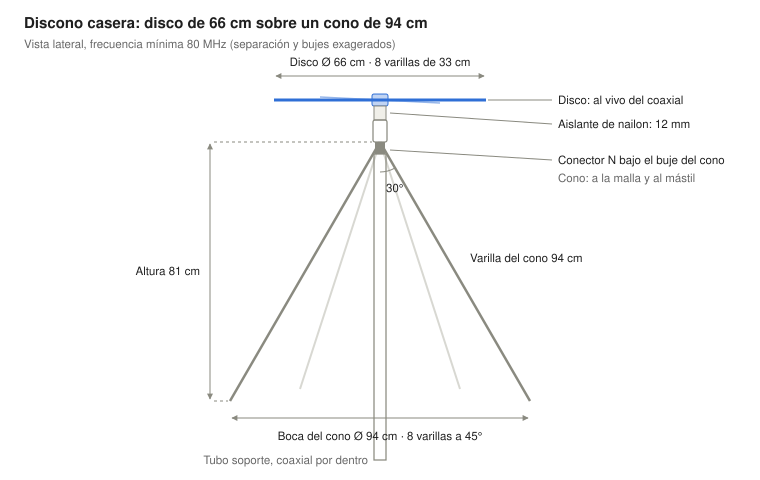
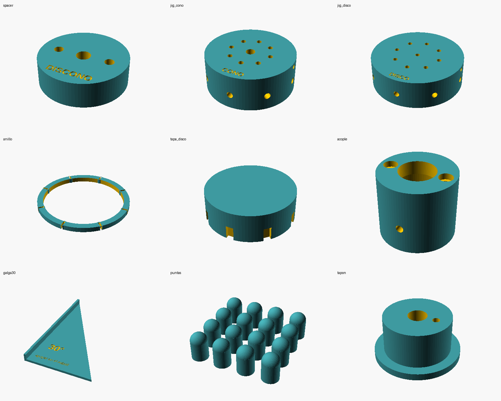

# Guía de construcción: antena discono casera 80–1300 MHz

Una discono de 8 + 8 varillas cubre de 80 a más de 1000 MHz con una sola bajada, por unos 25–40 € de materiales (una comercial tipo Diamond D-130J cuesta unos 140 €).

- **Usos típicos:** escáner y SDR en FM 87,5–108, aviación 118–137, VHF marina 156–162 y AIS, DAB+ 174–240 y UHF.
- **Polarización:** vertical. **Ganancia:** 0–2 dBi, omnidireccional.
- **Tiempo:** una tarde (3–4 h). **Nivel:** bricolaje básico, sin soldar aluminio.

Las medidas salen de las proporciones clásicas de la discono (Kandoian). Son de partida: la sección de comprobación explica cómo verificarlas.

El disco (arriba) va al vivo del coaxial; el cono y el mástil van a la malla, separados del disco solo por el aislante.

## 1. Medidas (frecuencia mínima 80 MHz)

| Pieza | Medida teórica | Medida de corte |
|---|---|---|
| Varilla del cono (×8), desde el vértice | 94 cm | 95 cm (1,2 cm entran en el buje; se recorta después) |
| Ángulo de cada varilla respecto al mástil | 30° (cono de 60°) | — |
| Diámetro de la boca del cono | 94 cm | — |
| Altura del cono | 81 cm | — |
| Varilla del disco (×8), desde el centro | 33 cm | 32 cm con buje de 50 mm (30,5 libres + 1,5 dentro) |
| Diámetro del disco | 66 cm | — |
| Buje del cono (arriba) | Ø40 mm | barra de aluminio de 25 mm de alto |
| Separación disco–cono | 12 mm | 12 mm (0,3 × 40 mm) |
| Separación angular entre varillas | 45° | 45° |

**Para otra frecuencia mínima** usa `python3 calcular_discono.py <MHz>`, o las fórmulas:

- Varilla del cono (cm) = 7500 ÷ frecuencia mínima (MHz)
- Diámetro del disco = 0,7 × varilla del cono (con cono de 60°)
- Separación disco–cono = 0,3 × diámetro del buje del cono

| Frecuencia mínima | Varilla del cono | Diámetro del disco | Uso |
|---|---|---|---|
| 50 MHz | 150 cm | 105 cm | Añade la banda de 6 m; más grande y pesada |
| 70 MHz | 107 cm | 75 cm | Margen extra por debajo de la FM |
| **80 MHz** | **94 cm** | **66 cm** | **Equilibrio tamaño/cobertura (recomendada)** |
| 100 MHz | 75 cm | 53 cm | Aviación, marina y UHF; la FM entra peor |

Por encima de unas 12 veces la frecuencia mínima el diagrama se levanta y la antena rinde menos en el horizonte.

## 2. Materiales

Precios orientativos, no consultados.

| # | Material | Cantidad | Detalle | Precio aprox. |
|---|---|---|---|---|
| 1 | Varilla de aluminio maciza Ø4–5 mm | 8 × 95 cm + 8 × 32 cm (≈10 m) | Varilla de soldadura TIG de aluminio o de latón | 10–15 € |
| 2 | Buje del cono | 1 | Barra redonda de aluminio Ø40 mm, trozo de 25 mm | 3–5 € |
| 3 | Buje del disco | 1 | Barra redonda de aluminio Ø50 mm, trozo de 12 mm | 3 € |
| 4 | Separador aislante | 1 | Taco de PVC/nailon/teflón Ø40 × 12 mm, o la pieza 3D `spacer` | 2 € |
| 5 | Conector hembra de chasis | 1 | N (mejor, estanco) o SO-239, con brida de 4 tornillos | 4–8 € |
| 6 | Hilo de cobre rígido | 5 cm | 1,5–2,5 mm² | — |
| 7 | Tubo soporte | 1 | PVC o aluminio Ø25–32 mm, 50–80 cm | 3–6 € |
| 8 | Prisioneros M4 inox | 16 | Fijan cada varilla en su buje | 3 € |
| 9 | Tornillos de nailon M4 + tuercas | 2 | Unen disco, aislante y cono (metálicos harían cortocircuito) | 1 € |
| 10 | Abrazaderas en U inox | 2 | Tubo al mástil | 4 € |
| 11 | Coaxial de bajas pérdidas | según bajada | H-155 o RG-213 si pasa de 10 m | 1–2 €/m |
| 12 | Conector macho | 1 | N o PL-259 | 3–5 € |
| 13 | Autovulcanizante + silicona neutra | 1 + 1 | Estanqueidad | 6 € |
| 14 | Grasa dieléctrica | 1 | Contra la corrosión entre metales | 4 € |
| 15 | Tapón de PVC | 1 | Tapa el buje del disco (o la pieza 3D `tapa_disco`) | 1 € |

## 3. Herramientas

- Taladro (mejor de columna) y brocas de 2,5 / 3,3 / 4,2 / 6 mm
- Macho de roscar M4 con maneral
- Sierra de metal y lima
- Transportador o la galga 3D de 30°
- Calibre y cinta métrica, tornillo de banco, llaves
- Soldador de estaño 40–60 W
- Opcional: analizador NanoVNA

## 4. Construcción paso a paso

### A. Cortar las varillas

1. Endereza la varilla rodándola sobre una mesa plana.
2. Corta **8 varillas de 95 cm** (cono) y **8 de 32 cm** (disco).
3. Lima las puntas y achaflana el extremo que entra en el buje.
4. Marca la profundidad de inserción: 12 mm en las del cono, 15 mm en las del disco.

### B. Buje del disco (Ø50 × 12 mm)

1. Marca el centro y 8 radios a 45° (o usa la plantilla 3D `jig_disco`).
2. Taladra en el canto **8 agujeros radiales de 4,2 mm**, 15 mm de profundidad, a media altura.
3. Encima de cada uno, desde la cara superior, taladra a 3,3 mm y rosca **M4** para el prisionero.
4. Taladra el centro a 3,3 mm y rosca M4 para el hilo del conector.

### C. Buje del cono (Ø40 × 25 mm)

1. Taladra el eje de lado a lado a **6 mm** (por ahí sube el vivo).
2. En la cara inferior, centra la brida del conector, marca y rosca sus 4 agujeros.
3. Amplía el centro de la cara inferior para que entre el cuerpo del conector y la brida apoye plana.
4. En el canto, a 8 mm de la cara superior, taladra **8 agujeros radiales de 4,2 mm** a 45°, 12 mm de profundidad (o usa `jig_cono`).
5. Encima de cada agujero, rosca M4 para su prisionero.

### D. Separador aislante (Ø40 × 12 mm)

1. Taladra el centro a 6 mm.
2. Taladra 2 agujeros de 4,2 mm a 12 mm del centro, enfrentados, para los **tornillos de nailon**.
3. Repite esos 2 agujeros en ambos bujes, roscando M4 en el del cono.

### E. Conector y vivo

1. Atornilla el conector por debajo del buje del cono (la malla queda unida al cono).
2. Suelda al pin central un hilo de cobre rígido de 5 cm.
3. Pásalo por el centro del cono y del separador **sin que toque el aluminio** (aíslalo con dieléctrico de coaxial).
4. Coloca separador y disco, y únelos al cono con los 2 tornillos de nailon.
5. Haz un ojal en el hilo y atorníllalo al centro del disco. El tramo debe ser recto y corto.
6. Polímetro: **vivo–disco = continuidad**, **malla–cono = continuidad**, **disco–cono = abierto**.

### F. Varillas

1. Mete las 8 del disco hasta la marca y aprieta los prisioneros: horizontales y a 45°.
2. Mete las 8 del cono hasta la marca y aprieta.
3. Dobla cada varilla del cono **a 1 cm del buje**, con radio suave, hasta **30° con el eje** (galga `galga30`).
4. Comprueba: puntas en un círculo de **94 cm** y unos **81 cm** por debajo del buje.
5. Iguala las puntas recortando las largas.

### G. Tubo soporte

1. Fija el buje del cono en lo alto del tubo (o con la pieza 3D `acople`).
2. Pasa el coaxial por dentro y conéctalo antes de cerrar.
3. Deja un bucle de goteo a la salida del tubo.

## 5. Piezas imprimibles en 3D

Carpeta [`3d/`](3d/): archivo OpenSCAD paramétrico, 9 STL y [LEEME](3d/LEEME.txt). Imprimir en **PETG o ASA** (exterior).

| Pieza | Tamaño | Uds | Para qué |
|---|---|---|---|
| spacer | Ø40 × 12 mm | 1 | Aislante disco–cono (relleno 100 %) |
| jig_cono | Ø60 × 24 mm | 1 | Plantilla de taladrado del buje Ø40 |
| jig_disco | Ø70 × 22 mm | 1 | Plantilla de taladrado del buje Ø50 |
| galga30 | 90 × 150 mm | 1 | Doblar las varillas del cono a 30° |
| anillo | Ø194 × 10 mm | 1 | Separador del cono, ~10 cm bajo el buje (cama ≥ 200 × 200) |
| tapa_disco | Ø55 × 18 mm | 1 | Tapa antilluvia del buje del disco |
| puntas | Ø9 × 14,5 mm | 16 | Protectores de las puntas |
| acople | Ø44 × 38 mm | 1 | Buje del cono → tubo Ø32 con el conector dentro |
| tapon | Ø36 × 18 mm | 1 | Tapón inferior con paso del coaxial y drenaje |

Los bujes siguen siendo de aluminio porque llevan la RF. Mide tu conector N antes de imprimir el `acople` (hueco de 21 mm).

## 6. Estanqueidad y corrosión

1. Grasa dieléctrica en prisioneros y contactos entre metales distintos.
2. Silicona **neutra** (no ácida) alrededor del hilo central en el separador.
3. Tapa el buje del disco con la cazoleta o `tapa_disco`.
4. Autovulcanizante en los conectores, estirada un 50 % y solapada; encima cinta aislante contra el sol.
5. Agujero de drenaje de 2 mm en la parte baja del tubo.

## 7. Comprobación y ajuste

Objetivo: ROE < 2:1 desde ~85 MHz hasta pasado 1 GHz, medida en exterior.

**Con NanoVNA:** calibra (open/short/load) al final del cable, barre 50–1300 MHz y:

- ROE alta en todo el rango → revisa la separación disco–cono (prueba 8–15 mm) y el vivo.
- Mala solo por debajo de 90–100 MHz → varillas del cono cortas o cono muy abierto (ciérralo a 25°).
- Picos sueltos en UHF → alguna varilla distinta en longitud o ángulo.

**Sin analizador:** compara con la antena anterior los niveles de canal 16 (156,800), AIS (161,975), una torre de aeropuerto cercana y una FM débil, o cuenta los barcos AIS recibidos en una hora.

## 8. Instalación

1. Tubo al mástil con dos abrazaderas en U, el disco por encima de la punta del mástil.
2. Al menos 1–2 m de separación con otras antenas.
3. Coaxial pegado al mástil con bridas cada 50 cm y bucle de goteo.
4. Descargador coaxial a la entrada unido a la toma de tierra (16 mm²).
5. Si la FM se cuela en aviación en tu SDR, baja la ganancia.

## 9. Problemas frecuentes

| Síntoma | Causa probable | Solución |
|---|---|---|
| No se recibe nada | Vivo tocando el cono o hilo suelto | Disco–cono debe dar abierto; rehaz el hilo |
| Peor que la antena anterior en VHF baja | Varillas del cono cortas o cono muy abierto | Cierra a 25–30° o alarga |
| FM en la banda de aviación | Saturación del receptor | Baja la ganancia |
| Ruido de fondo alto | Routers, LED, cargadores cerca | Sube y aleja la antena |
| Cambia con la lluvia | Agua en conector o buje | Seca, sella, drena |
| Varillas torcidas por el viento | Prisioneros flojos o varilla fina | Fijador de roscas; varilla de 5 mm; `anillo` 3D |
